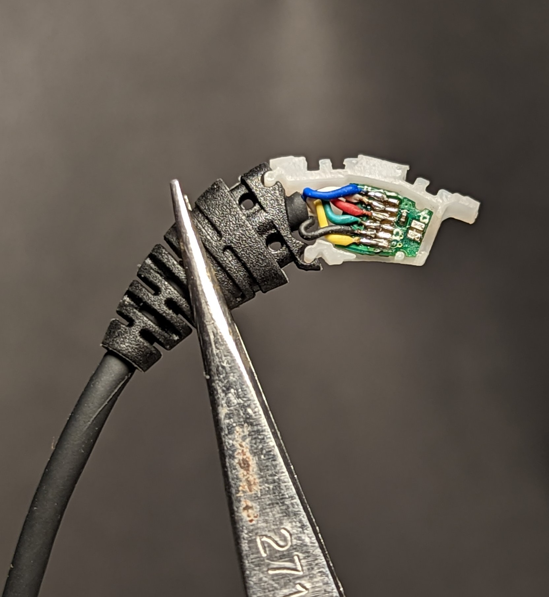
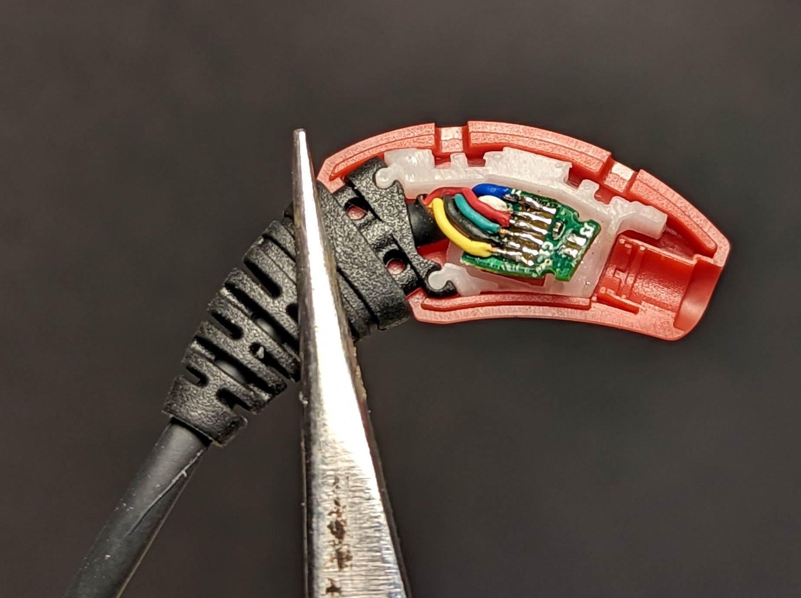
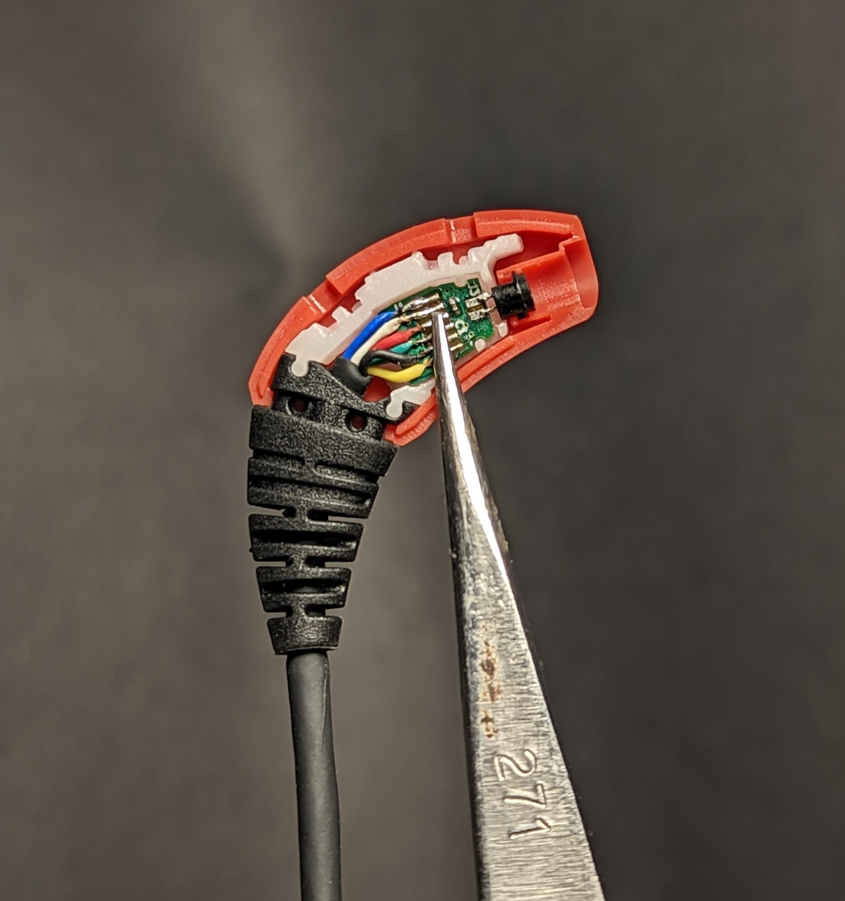
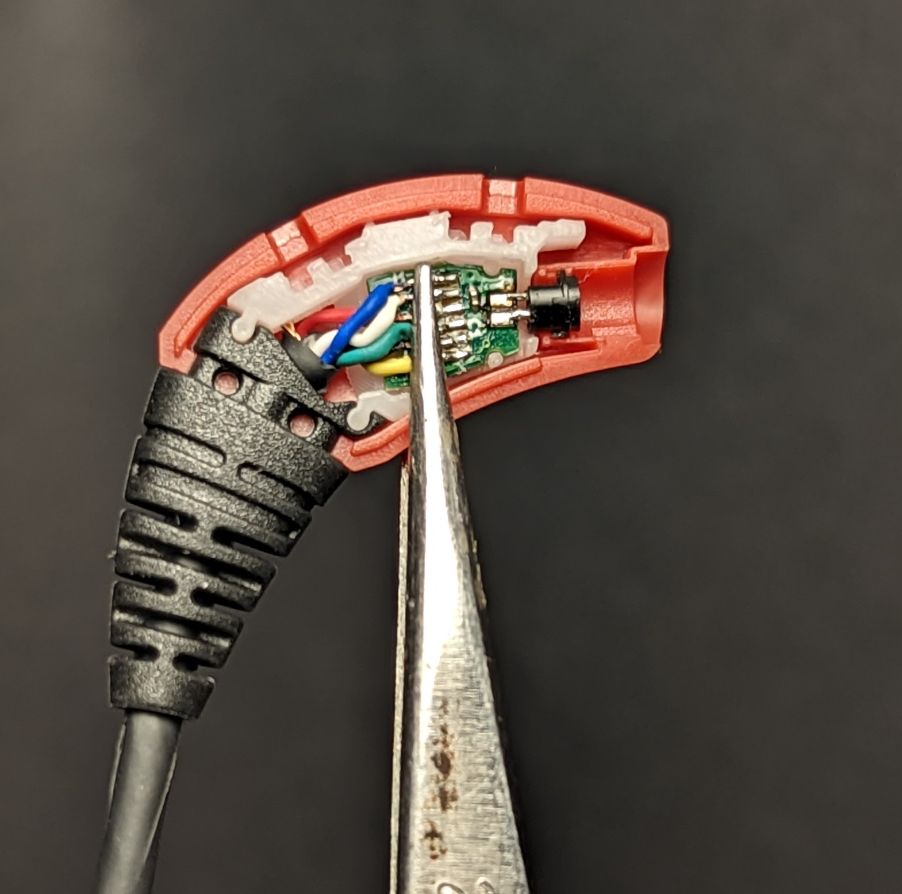
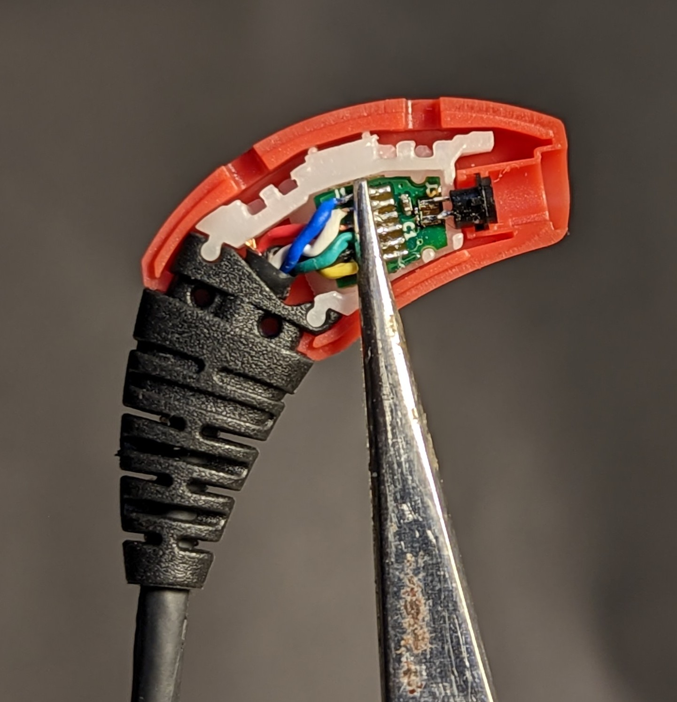
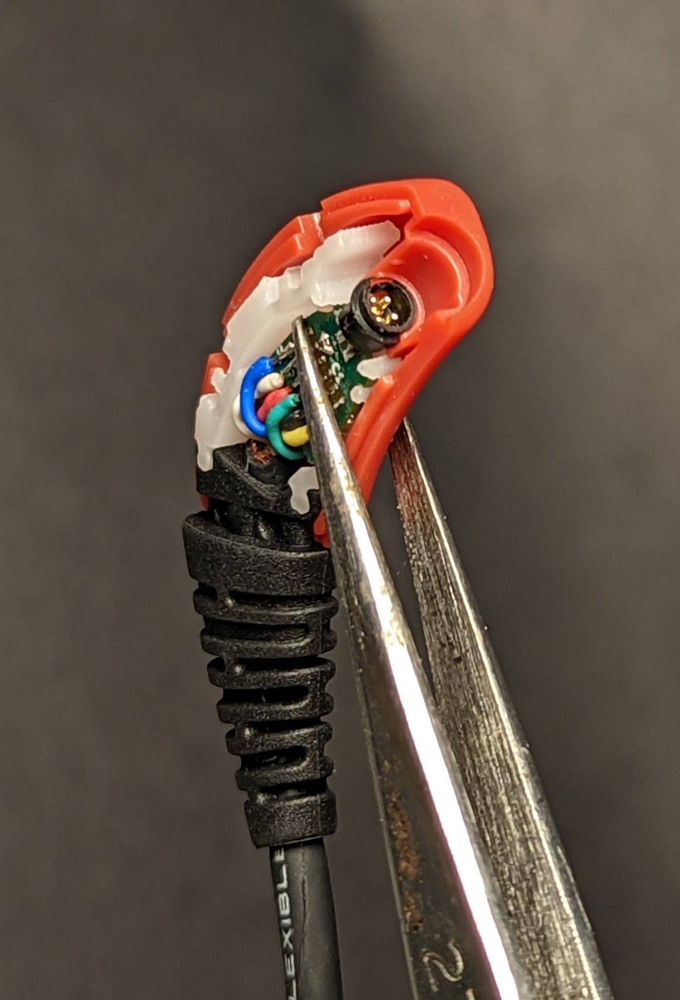
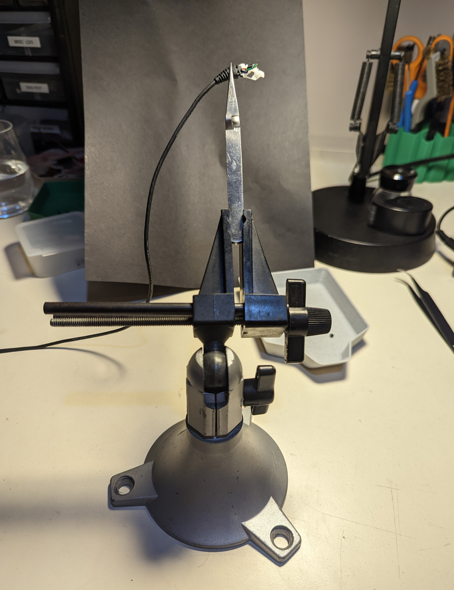

# CS-44 Connector Assembly Guide

This guide will show you how to correctly position the CS-44 connector prior to soldering it in place. The position of the CS-44 connector in relation to the Rigid PCB is critical for the fitting together of all the molded parts. No joke, incorrect placement of the CS-44 connector will make it impossible to fit the parts together as designed. Notice in the image below the registration features in the light-blue piece. This is called the 'Microphone Carrier'. The Microphone Carrier is designed to fit very snugly into the outer Clamshell casing, thereby locking the Rigid PCB in place. The CS-44 **must** be in the correct place to fit into the Clamshell molded features. With the understanding that all setups are different and that individuals have varying levels of expertise in hand work, I will describe the process that I use at Flywheel Lab.

## Step 1

Dry fit the Cable Assembly and the Microphone Carrier part. This can be done with the fingers. Make sure that the Rigid PCB is facing with the soldered connections toward you as in the photo. It is easy to use the fingers to fit the Rigid PCB into the Microphone Carrier molded placement. The cable can be 'massaged' in order to reduce or enhance the exposed cable inside the Microphone Carrier allowed space.

## Step 2

Dry fit the outer Clamshell to the assembly. This fit is snug and it will hold position very well. The Rigid PCB does not have to be fit snug in the Microphone Carrier. As long as it was dry fit in Step 1, it can move slightly to fit the Clamshell on. 

## Step 3

This is the critical step. Use tweezers to align and position the CS-44 connector leads so that they straddle the Rigid PCB. Then put the Rigid PCB into the molded placement for it in the Microphone Connector. This assembly can be clamped with tweezers, and when it is correct it is stable. Here are images of the tweezer-clamped assembly.

Verify that the CS-44 connector is fit into the molded features that are designed to hold it. By looking 'down' onto the connector, you can see that it is positioned correctly, seated into the mold. This assembly, when all the parts are correctly aligned, is very stable. I use tweezers to clamp the assembly between the Rigid PCB and the outer Clamshell. This ensures proper relation between the parts.

At this point, the CS-44 leads can be soldered to the pads on the exposed side of the board. Then, the assembly can be removed from the Clamshell and Microphone Carrier and set aside. The next step will be to solder the CS-44 pins on the opposite side. Once that is done, the cable assembly is ready for further processing.

## Setup

For reference, this is the setup that I used at Flywheel Lab to do the processing above and take the photos.
The photos were taken with a Pixel 6 cell.

